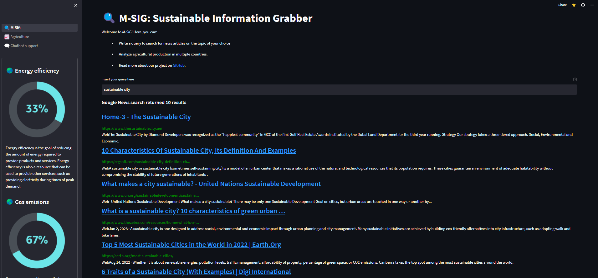

# M-SIG: MSME’s Sustainability Information Grabber 🔍

An all-in-one place digital platform that would help equip MSMEs with the power of extracting useful sustainability information with regards to regulations, best practices, technology, or financing in sustainability through the help of NLP and deep learning models.

Made during the [Siemens Tech for Sustainability 2023](https://ecosystem.siemens.com/techforsustainability/hackathon/overview?linkId=300000004465793) Hackathon.

## 📌 How to run
- Click on [this link](https://m-sig-siemens.streamlit.app/)
- Enter a sustainable query
- Analyze different agricultural production rates of multiple countries
- Consult with a chatbot
